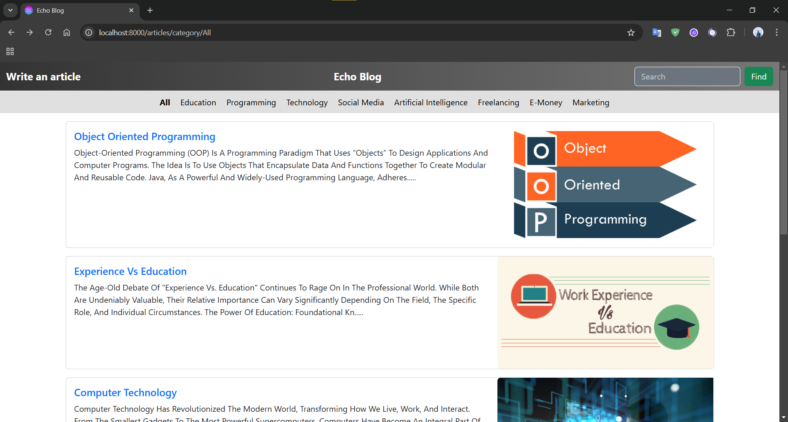
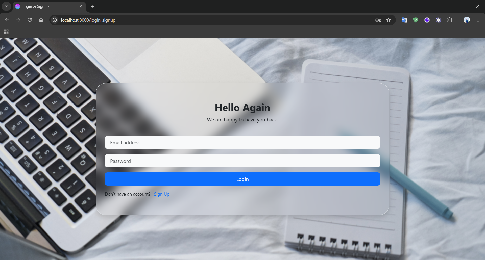
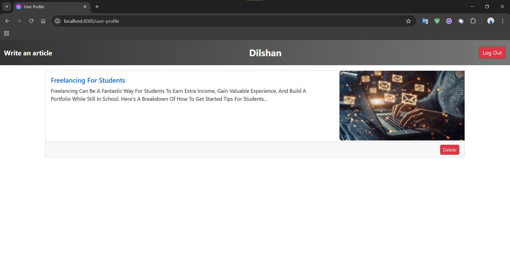
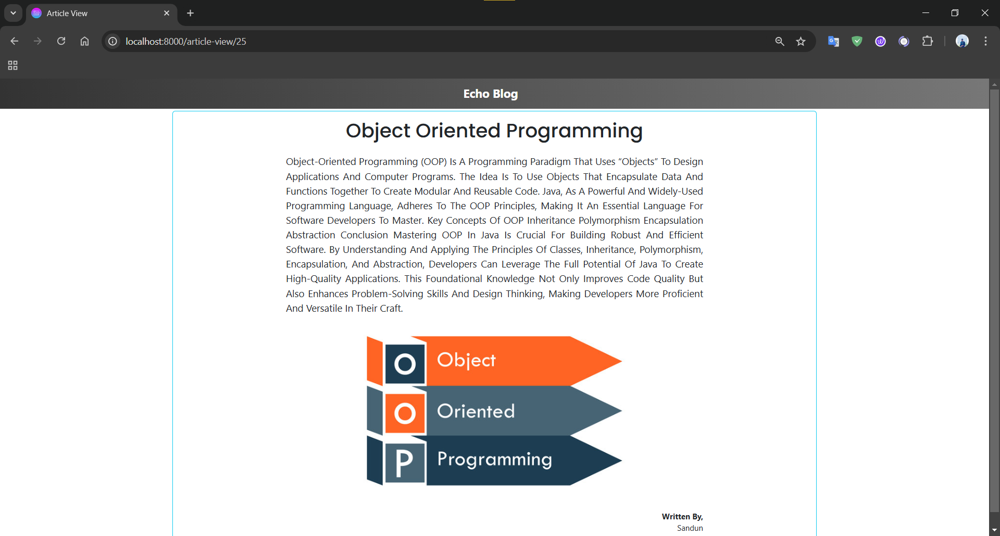

<a href="https://git.io/typing-svg"></a>

<p align="center"></p>

<p id="description">Echo Blog is a modern blogging platform that combines simplicity functionality and aesthetics to provide a seamless experience for both writers and readers. Built with Laravel Bootstrap and MySQL the project is designed to address the needs of content creators and audiences alike by enabling users to create explore and engage with articles effortlessly.</p>

<h2>Project Screenshots:</h2>







  
  
<h2>🧐 Features</h2>

Here're some of the project's best features:

*   Write Articles: Easily create and publish blog posts.
*   Category-Based Filtering: Browse articles by specific categories like Technology Programming AI etc.
*   Search Functionality: Search articles dynamically by their titles.
*   Responsive Design: Optimized for mobile and desktop devices.
*   Author Attribution: Display the author's name for each post.

<h2>🛠️ Installation Steps:</h2>

<p>1. Clone this repository:</p>

```
https://github.com/sandundil2002/Echo-Blog.git
```

<p>2. Install dependencies:</p>

```
composer install npm install
```

<p>3. Configure your .env file:</p>

```
DB_CONNECTION=mysql   DB_HOST=127.0.0.1   DB_PORT=3306   DB_DATABASE=your_database   DB_USERNAME=your_username   DB_PASSWORD=your_password  
```

<p>4. Run migrations and seed the database (optional):</p>

```
php artisan migrate --seed
```

<p>5. Start the development server:</p>

```
php artisan serve
```

<p>6. Open your browser and visit:</p>

```
http://localhost:8000
```

  
  
<h2>💻 Built with</h2>

Technologies used in the project:

*   Frontend: Blade Templates Bootstrap
*   Backend: Laravel Framework
*   Database: MySQL
*   Styling: Custom CSS and Bootstrap

<h2>🛡️ License:</h2>

This project is licensed under the MIT Licence
